# Seleção de Prioris para Regressão Linear Bayesiana em Dados Heterocedásticos

## Introdução

Modelos de regressão linear são essenciais no mundo visto sua vasta aplicação em diversos fenômenos no mundo, desde àreas de medicina ao seu uso em finanças e, como a teoria bayesiana trouxe consigo a possibilidade de modelar a incerteza acerca de parâmetros de interesse, a análise de relações lineares tornou-se mais robusta, podendo calibrar parâmetros do modelo como os coeficientes e a variância. Este último parâmetro é especialmente importante pois sua constância é um dos pressupostos para desenvolver o modelo, porém, em muitos casos, temos uma variância que não é constante. Quando isto se aplica, então diz-se que os dados são heterocedásticos.
O presente trabalho tem como objetivo analisar estes casos e aplicar técnicas bayesianas para modelar a variância para que o modelo melhor se ajuste aos dados.

<p align="center"></p>

## Modelagem

### Regressão Linear Simples

Uma regressão linear é um método estatístico que modela a relação entre duas variáveis tal que a variabilidade de uma seja explicada pela outra e é uma das mais usadas para investigar fenômenos. Para uma amostra de $n$ elementos de duas variáveis aleatórias $X$ e $Y$ com uma certa relação linear temos

$$
y_i = \beta_0 + \beta_1 x_i + e_i \, \, i = 1,2,...,n\, \text{ e } e_i \sim N(0,\sigma^2)
$$

Com $sigma^2$ sendo constante e $\beta_0, \beta_1$ são o intercepto e o coeficiente angular, respectivamente, e $e_i$ são erros aleatórios. Como a combinação linear de variáveis normais gera uma normal, temos:

$$
Y \sim N(\beta_0 + \beta_1X, \sigma^2)
$$

A partir do método dos mínimos quadrados temos as soluções para os coeficientes que minimizem a soma dos resíduos:

$$
\hat{\beta_0} = \bar{Y} - \beta_1\bar{X}
$$
$$
\hat{\beta_1} = \frac{\sum_{i=1}^n y_i(x_i-\bar{x})}{\sum_{i=1}^n x_i(x_i-\bar{x})}
$$

### Teste de Hipóteses

$\beta_0$ e $\beta_1$ são estimadores não enviesados e seguem uma distribuição normal: 

\begin{description}
  \item[\emph{(i)}] $\hat{\beta_0} \sim N(\beta_0,\sigma^2 (\frac{1}{n} + \frac{\bar{X}^2}{S_{xx}}))$
  \item[\emph{(ii)}] $\hat{\beta_1} \sim N(\beta_1, \frac{\sigma^2}{S_{xx}})$
\end{description}

Com $S_{xx} = \sum_{i=1}^n x_i(x_i-\bar{x})$. Com isto, temos os testes de hipóteses de significância do coeficiente:

$$
H_0: \beta_1 = 0 \text{ vs }H_1:\beta_1 \neq 0
$$

Sob $H_0,\, \beta_1 = 0$, e, como $\frac{SQ_{res}}{\sigma^2} \sim \chi^2_{(n-2)}$ e $\frac{\hat{\beta_1} - \beta_1}{\sqrt{\frac{\sigma^2}{S_{xx}}}} \sim N(0,1)$ temos que uma razão de uma normal padrão e a raiz de uma qui-quadrado dividida pelos (n-2) graus de liberdade resultando em uma distribuição T-Student com (n-2) graus de liberdade: 

$$
\frac{\hat{\beta_1}}{\sqrt{\frac{QM_{res}}{S_{xx}}}} \sim t_{(n-2)}
$$

A significância da regressão realiza o teste:

$$
H_0: \beta_0 = \beta_1 = 0 \text{ vs } H_1: \beta_i \neq 0, \,\forall i = 0,1
$$

E é testada com a estatística de teste que segue uma distribuição F-Snedecor pois é a razão de duas qui-quadrados independentes:

$$
\frac{QM_{reg}}{QM_{res}} \sim F_{(1),(n-2)}
$$

E pode ser calculada com a ajuda da tabela ANOVA:

| Fatores de Variação | SQ | Graus de Liberdade | QM | F |
|--------------------|----|-------------------|----|---|
| Regressão | $SQ_{reg} = \beta_1 S_{xy}$ | $1$ | $QM_{reg} = SQ_{reg}$ | $\frac{QM_{reg}}{QM_{res}}$ |
| Resíduos | $SQ_{res} = SQ_{tot} - SQ_{reg}$ | $n-2$ | $QM_{res} = \frac{SQ_{res}}{n-2}$ |  |
| Total | $SQ_{tot} = \sum_{i=1}^n (Y_i - \bar{Y})^2$ | $n-1$ |  |  |


A métrica $R^2$ é a medida que avalia o quão bem a variabilidade do modelo explica a variabilidade dos dados:

$$
R^2 = \frac{SQ_{res}}{SQ_{tot}}
$$

### Diagnóstico de Homocedasticidade

O Teste de Goldfeld-Quandt avalia a homocedasticidade dos dados, onde suas hipóteses são

$$
\begin{cases}
  H_0: \text{A variância dos erros é constante, ou seja, os dados são homocedásticos}\\
  H_1: \text{A variância dos erros não é constante e, portanto, os dados são heterocedásticos}
\end{cases}
$$

O teste avalia a razão de estimativas da variância dos resíduos entre dois modelos ajustados por subconjuntos da amostra e, sob $H_0$, a estatística de teste segue, assintoticamente, uma distribuição F-Snedecor com graus de liberdade $(n_1 - 1)$ e $(n_2 - 1)$, onde $n_1,n_2$ são os tamanhos dos subconjuntos.

Para modelar a heterocedasticidade dos dados usaremos métodos bayesianos com priori não-informativa e informativa para, ao fim, selecionar o que melhor se encaixa aos dados com a métrica de critério de informação de Watanabe-Akaike.

### Prioris para os Coeficientes e $\sigma^2$ da Regressão

Para obter uma posteriori mais flexível em relação à variância consideraremos duas prioris: uma não-informativa e uma informativa. Ambas as prioris seguirão a mesma distribuição, somente mudará a gama de seus parâmetros, adaptando para obter uma priori informativa.

A priori será uma normal para os coeficientes: $\beta_0, \beta_1 \sim N(0, \sigma^2_b)$, onde $\sigma^2_b$ é grande para o caso de priori não-informativa e $\sigma^2$ será analisada a fim de melhor se ajustar aos dados para a priori informativa.
Para $\sigma^2$ consideraremos uma gama-inversa: $\sigma^2 \sim Gama-Inv(\alpha, \beta)$. Adaptaremos os parâmetros para transformar em priori informativa.

Assim, temos as prioris

$$
\mathbf{\beta} \sim N_2(0, \sigma^2 _b)
$$
$$
\sigma^2 \sim Gama-Inv(\alpha, \beta)
$$

Considerando a amostra aleatória de dados $Y_1,...,Y_n$ com $Y \sim N(\beta_0 + \beta_1 X, \sigma^2)$ temos a verossimilhança:

$$
L(y_i| x_i, \beta_0, \beta_1, \sigma^2) = \prod_{i=1}^n f_{Y_i}(y_i| x_i, \beta_0, \beta_1, \sigma^2) \\
=\prod_{i=1}^n (2\pi)^{\frac{-1}{2}} (\sigma^2)^{\frac{-1}{2}} e^{\frac{-1}{2\sigma^2}(y_i - \beta_0 -\beta_1x_i)^2} \\
= (2\pi)^{\frac{-n}{2}} (\sigma^2)^{\frac{-n}{2}} e^{\frac{-1}{2\sigma^2}\sum_{i=1}^n (y_i - \beta_0 -\beta_1x_i)^2} \\
= (2\pi)^{\frac{-n}{2}} (\sigma^2)^{\frac{-n}{2}} e^{\frac{-1}{2\sigma^2}\sum_{i=1}^n (y_i^2 -2\beta_0 y_i - 2\beta_1 x_i y_i +\beta_0^2 + 2\beta_0\beta_1 x_i + \beta_1^2 x_i^2)}
$$

A distribuição das prioris é

$$
p(\beta_0) = (2\pi)^{\frac{-1}{2}} (\sigma_b^2)^{\frac{-1}{2}} e^{-\frac{\beta_0^2}{2\sigma_b^2}}
$$
$$
p(\beta_1) = (2\pi)^{\frac{-1}{2}} (\sigma_b^2)^{\frac{-1}{2}} e^{-\frac{\beta_1^2}{2\sigma_b^2}}
$$
$$
p(\sigma^2) = \frac{\beta^{-\alpha}}{\Gamma(\alpha)} (\sigma^2)^{-\alpha-1} e^{\frac{-\beta}{\sigma^2}}
$$

Assim, a distribuição a posteriori dos parâmetros é proporcional à distribuição conjunta:


$$
p(\beta_0,\beta_1,\sigma^2|y_i) \propto L(y_i| x_i, \beta_0, \beta_1, \sigma^2)p(\beta_0)p(\beta_1)p(\sigma^2) =\\
(2\pi)^{\frac{-n}{2}} (\sigma^2)^{\frac{-n}{2}} e^{\frac{-1}{2\sigma^2}{\sum_{i=1}^n (y_i^2 -2\beta_0 y_i - 2\beta_1 x_i y_i +\beta_0^2 + 2\beta_0\beta_1 x_i + \beta_1^2 x_i^2)}} (2\pi)^{\frac{-1}{2}} (\sigma_b^2)^{\frac{-1}{2}} e^{-\frac{\beta_0^2}{2\sigma_b^2}} (2\pi)^{\frac{-1}{2}} (\sigma_b^2)^{\frac{-1}{2}} e^{-\frac{\beta_1^2}{2\sigma_b^2}}
\frac{\beta^{-\alpha}}{\Gamma(\alpha)} (\sigma^2)^{-\alpha-1} e^{\frac{-\beta}{\sigma^2}} \\
\propto  (\sigma^2)^{\frac{-n}{2}} e^{\frac{-1}{2\sigma^2}{\sum_{i=1}^n (-2\beta_0 y_i - 2\beta_1 x_i y_i +\beta_0^2 + 2\beta_0\beta_1 x_i + \beta_1^2 x_i^2)}}  e^{-\frac{\beta_0^2}{2\sigma_b^2}} e^{\frac{-\beta_1^2}{2\sigma_b^2}}(\sigma^2)^{-\alpha-1} e^{\frac{-\beta}{\sigma^2}}
$$

Para o coeficiente $\beta_0$ temos a condicional completa:

$$
p(\beta_0|\beta_1, \sigma^2, y_i) \propto e^{\frac{-1}{2\sigma^2}\sum_{i=1}^n (-2\beta_0 y_i +\beta_0^2 + 2\beta_0\beta_1 x_i )}  e^{-\frac{\beta_0^2}{2\sigma_b^2}} \\
= e^{\frac{-1}{2\sigma^2}(\beta_0^2(n + \frac{\sigma^2}{\sigma^2_b}) - 2\beta_0 \sum_{i=1}^n (\beta_1 x_i-y_i))} \\
= e^{\frac{-1}{2\sigma^2}(n + \frac{\sigma^2}{\sigma^2_b})(\beta_0^2 - 2\beta_0 \frac{\sum_{i=1}^n (\beta_1 x_i-y_i )}{(n + \frac{\sigma^2}{\sigma^2_b})})} \\
= e^{\frac{-1}{2\sigma^2}(n + \frac{\sigma^2}{\sigma^2_b})(\beta_0^2 - 2\beta_0 \frac{\sum_{i=1}^n (\beta_1 x_i-y_i)}{(n + \frac{\sigma^2}{\sigma^2_b})} + (\frac{\sum_{i=1}^n (\beta_1 x_i-y_i)}{(n + \frac{\sigma^2}{\sigma^2_b})})^2 - (\frac{\sum_{i=1}^n (\beta_1 x_i-y_i )}{(n + \frac{\sigma^2}{\sigma^2_b})})^2)} \\
\propto e^{\frac{-1}{2\sigma^2}(n + \frac{\sigma^2}{\sigma^2_b})(\beta_0 - (\frac{\sum_{i=1}^n (\beta_1 x_i-y_i)}{(n + \frac{\sigma^2}{\sigma^2_b})}))^2} \\
= \underbrace{e^{\frac{-1}{2}(\frac{n}{\sigma^2} + \frac{1}{\sigma^2_b})(\beta_0 - (\frac{\sum_{i=1}^n (\beta_1 x_i-y_i)}{(n + \frac{\sigma^2}{\sigma^2_b})}))^2}}_{\text{Núcleo de Normal}}
$$

E, assim, a condicional completa de $\beta_0$ é

$$
\beta_0 \sim N((\frac{\sum_{i=1}^n (\beta_1 x_i-y_i)}{(n + \frac{\sigma^2}{\sigma^2_b})}), (\frac{n}{\sigma^2} + \frac{1}{\sigma^2_b})^{-1})
$$

De modo análogo, a condicional completa de $\beta_1$ é

$$
p(\beta_1|\beta_0,\sigma^2, y_i) \propto e^{\frac{-1}{2\sigma^2}{\sum_{i=1}^n (-2\beta_1 x_i y_i + 2\beta_0\beta_1 x_i + \beta_1^2 x_i^2)}}  e^{\frac{-\beta_1^2}{2\sigma_b^2}} \\
= e^{\frac{-1}{2\sigma^2} (\beta_1^2 \sum_{i=1}^n x_i^2 - 2\beta_1 \sum_{i=1}^n (x_i y_i - \beta_0 x_i)) - \frac{\beta_1^2}{2\sigma^2_b}} \\
= e^{\frac{-1}{2\sigma^2} (\beta_1^2 (\sum_{i=1}^n x_i^2 + \frac{\sigma^2}{\sigma^2_b}) - 2\beta_1 \sum_{i=1}^n (x_i y_i - \beta_0 x_i))} \\
= e^{\frac{-1}{2\sigma^2} (\sum_{i=1}^n x_i^2 + \frac{\sigma^2}{\sigma^2_b}) \underbrace{(\beta_1^2 - \frac{2\beta_1 \sum_{i=1}^n (x_i y_i - \beta_0 x_i)}{(\sum_{i=1}^n x_i^2 + \frac{\sigma^2}{\sigma^2_b})})}_{\text{completando quadrados}} } \\
= \underbrace{\frac{-1}{2}e^{-(\sum_{i=1}^n x_i + \frac{\sigma^2}{\sigma^2_b}) (\beta_1 - \frac{\sum_{i=1}^n (x_i y_i - \beta_0 x_i)}{({\sum_{i=1}^n x_i^2}{\sigma^2} + \frac{1}{\sigma^2_b})})^2}}_{\text{Núcleo de Normal}}
$$

E, assim, a condicional completa de $\beta_1$ é uma normal:

$$
\beta_1 \sim N(\frac{\sum_{i=1}^n (x_i y_i - \beta_0 x_i)}{(\sum_{i=1}^n x_i^2 + \frac{\sigma^2}{\sigma^2_b})}, (\frac{\sum_{i=1}^n x_i}{\sigma^2} + \frac{1}{\sigma^2_b})^{-1})
$$

Para $\sigma^2$ temos:

$$
p(\sigma^2|\beta_0,\beta_1, y_i) \propto  (\sigma^2)^{\frac{-n}{2}} e^{\frac{-1}{2\sigma^2}{\sum_{i=1}^n (y_i - \beta_0 - \beta_1x_i)^2}}(\sigma^2)^{-\alpha-1} e^{\frac{-\beta}{\sigma^2}} \\
\propto \underbrace{(\sigma^2)^{\frac{-n}{2} - \alpha - 1} e^{\frac{-1}{2\sigma^2}(\sum_{i=1}^n (y_i - \beta_0 - \beta_1x_i)^2 + 2\beta)}}_{\text{Núcleo de Gama Inversa}}
$$

Por fim, a condicional completa de $\sigma^2$ é uma gama inversa:

$$
\sigma^2 \sim Gama-Inv(\frac{n}{2} + \alpha, \frac{(\sum_{i=1}^n (y_i - \beta_0 - \beta_1x_i)^2 + 2\beta)}{2})
$$

Com as condicionais completas, usaremos Amostrador de Gibbs juntamente ao algoritmo de Metropolis-Hastings para analisar a distribuição a posteriori dos parâmetros. A parte do Amostrador de Gibbs será feita para os coeficientes e o Metropolis-Hastings será utilizado para amostra $sigma$ no log-espaço, garantindo positiva. O algoritmo será da forma:

1. Inicialize $t = 0$

2. Especifique os valores iniciais dos parâmetros ($\beta_0^{(0)},\beta_1^{(0)},\sigma^2{^{(0)}}$)

3. Na iteração $t+1$,

   1. Gere $\beta_0^{(t+1)} \sim N((\frac{\sum_{i=1}^n (\beta_1^{(t)} x_i-y_i)}{(n + \frac{{\sigma^2}^{(t)}}{\sigma^2_b})}), (\frac{n}{{\sigma^2}^{(t)}} + \frac{1}{\sigma^2_b})^{-1}$

   2. Gere $\beta_1^{(t+1)} \sim N(\frac{\sum_{i=1}^n (x_i y_i - \beta_0^{(t+1)} x_i)}{(\sum_{i=1}^n x_i^2 + \frac{{\sigma^2}^{(t)}}{\sigma^2_b})}, (\frac{\sum_{i=1}^n x_i}{{\sigma^2}^{(t)}} + \frac{1}{\sigma^2_b})^{-1})$

   3. Para amostrar $\sigma^2$

      1. Calcule $RSS = \sum_{i=1}^n (y_i - b_0 - b_1 x_i)^2$.

      2. Gere $\eta^\ast \sim \mathcal{N}(\eta^{(t)}, \tau^2)$ sendo esta a proposta de distribuição.

      3. Calcule  
         $log \pi(\eta^\ast) = -(n + 2\alpha)\eta^\ast - \left(\frac{RSS}{2} + \beta\right)e^{-2\eta^\ast}$  
         e  
         $log \pi(\eta^{(t)}) = -(n + 2\alpha)\eta^{(t)} - \left(\frac{RSS}{2} + \beta\right)e^{-2\eta^{(t)}}$

      4. Obtenha a probabilidade de aceitação  
         $\rho = min(1,\exp\left(\log \pi(\eta^\ast) - \log \pi(\eta^{(t)})\right))$

      5. Gere $u \sim U(0,1)$

      6. Se $u \leq \rho$, aceite o valor e faça  
         $\eta^{(t+1)} = \eta$ e, assim, $\sigma^{2(t+1)} = \exp(2\eta^{(t+1)})$,  
         se não, faça $eta^{(t+1)} = e^{(t)}$

4. Incremente de $t$ para $t+1$ e retorne ao passo 3.


Após a cadeia gerar os valores, calcularemos a métrica $WAIC$ para, ao fim, definir o melhor modelo. A métrica tem como definição:

$$
WAIC = -2 \hat{lpd} + 2 \hat{p}_{WAIC} = -2\sum_{i=1}^n log(P(y_i|\hat{\theta_i})) + 2 \sum_{i=1}^n var_{post}(log(P(y_i|\theta_i))) 
$$

Onde $log(P(y_i|\hat{\theta_i}))$ é a log-verossimilhança calculada nas estimativas geradas dos parâmetros a cada iteração da cadeia:

$$
log(P(y_i|\hat{\beta_0},\hat{\beta_1},\hat{\sigma^2})) = log((2\pi)^{\frac{-1}{2}} (\sigma^2)^{\frac{-1}{2}} e^{\frac{-1}{2\sigma^2}(y_i - \hat{\beta_0} -\hat{\beta_1}x_i)^2} ) = \frac{-1}{2} log(2\pi) - \frac{1}{2} log(\sigma^2) - \frac{1}{\sigma^2}(y_i - \hat{\beta_0} - \hat{\beta_1} x_i)
$$

E $\sum_{i=1}^n var_{post}(log(P(y_i|\beta_0,\beta_1,\sigma^2)))$ é a soma das variâncias amostrais da log-verossilhança que analisa a variabilidade das estimativas até o estado atual da cadeia:

$$
l_i = log P(y_i|\beta_0^{(i)},\beta_1^{(i)},{\sigma^2}^{(i)})
$$
$$
Var_{post}(log(P(y_i|\beta_0,\beta_1,\sigma^2))) = \frac{1}{i - 1} \sum_{j=1}^i (l_{ij} - \bar{l_i})^2
$$

## Aplicação

### Desenvolvimento do Modelo de Regressão

Para o desenvolvimento do modelo usaremos duas séries temporais: a taxa SELIC e o índice IBOVESPA. A taxa SELIC foi buscada no [Sistema Gerenciador de Séries Temporais](https://www3.bcb.gov.br/sgspub/consultarvalores/consultarValoresSeries.do?method=consultarValores), plataforma mantida pelo BACEN (Banco Central) e o índice IBOVESPA foi puxada do site [Investing.com](https://br.investing.com/indices/bovespa-historical-data).
A evolução temporal de ambas séries é estacionária, com o índice IBOVESPA tendo uma tendência crescente ao longo do tempo, enquanto a taxa SELIC se mantém estacionária pela média. O comportamento é notado na figura \ref{Figura1}.

<p align="center">
  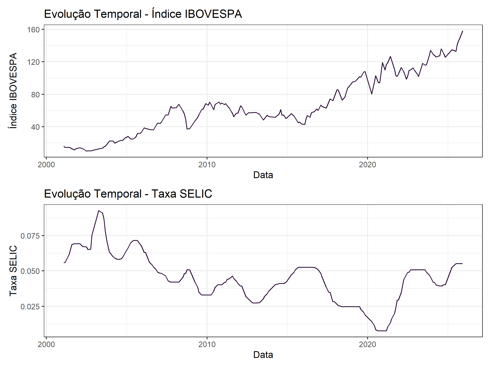
  <br>
  <em>Figura 1: Evolução Temporal - IBOVESPA e SELIC</em>
</p>

<p align="center">
  
  <br>
  <em>Figura 2: Boxplot e Histogramas - IBOVESPA e SELIC</em>
</p>

Pelo gráfico de dispersão \ref{Figura3}, podemos notar uma tendência linear decrescente entre as variáveis. Conforme o decorrer dos anos, a taxa SELIC tem uma tendência de queda até chegar ao seu mínimo no ano de 2021 (0,75\%) e, desde então, segue numa tendência de subida. Para o índice IBOVESPA, temos uma tendência crescente ao longo dos anos, chegando por volta dos 160 pontos em dezembro de 2025.

<p align="center">
  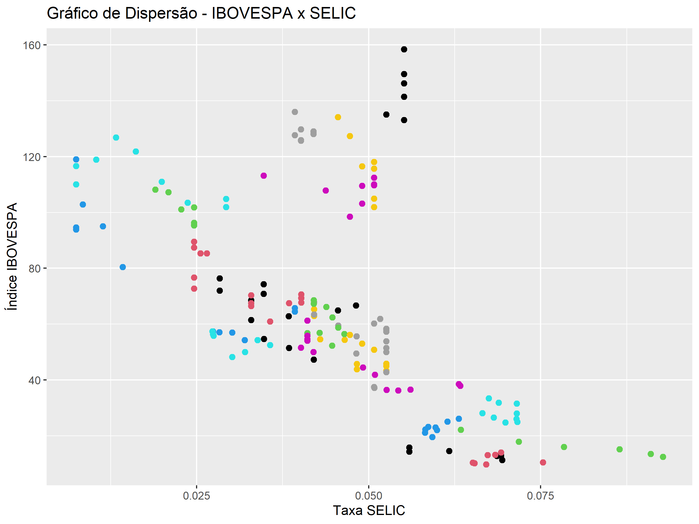
  <br>
  <em>Figura 3: Gráfico de Dispersão - IBOVESPA x SELIC</em>
</p>

Ao ajustar um modelo de regressão linear que tente analisar se a variável IBOVESPA afeta a variável SELIC, obtivemos a reta ajustada na figura \ref{Figura4}. Temos uma relação linear na qual a variável IBOVESPA afeta negativamente a variável SELIC e a magnitude do efeito (coeficiente do modelo referente ao índice) é $-0.00027$.

<p align="center">
  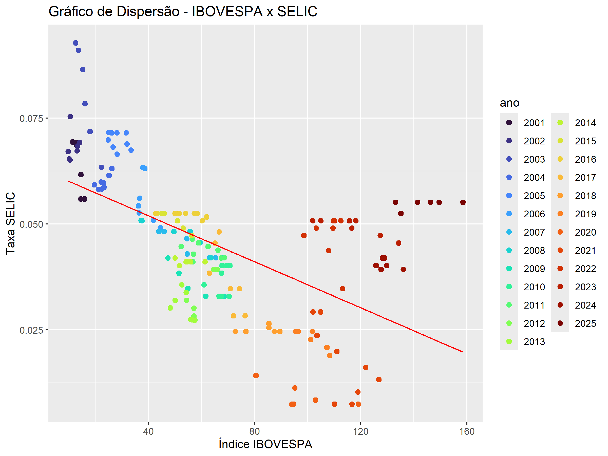
  <br>
  <em>Figura 4: Reta Ajustada - IBOVESPA x SELIC</em>
</p>

Analisando a saída das estatísticas do modelo de regresão temos que tanto a regressão ajustada quanto o coeficiente do índice IBOVESPA são significantes com as hipóteses dos testes:

(\emph{i}) Significância da Regressão:
$$
H_0: \beta_0 = \beta_1 = 0 \text{ vs } H_1: \beta_i \neq 0, \,\forall i = 0,1
$$

(\emph{ii}) Significância da variável explicativa:
$$
H_0: \beta_1 = 0 \text{ vs } H_1: \beta_1 \neq 0
$$

Como ambos os p-valores são baixos ($< 2.2e-16$ e $< 2.2e-16$), rejeitamos a hipótese nula, concluindo que a regressão e o coeficiente são significantes para explicar a taxa SELIC neste caso.


```text
Call:
lm(formula = df_series$selic ~ df_series$ibov)

Residuals:
      Min        1Q    Median        3Q       Max 
-0.029822 -0.010764 -0.001056  0.010227  0.035352 

Coefficients:
                 Estimate Std. Error t value Pr(>|t|)    
(Intercept)     6.279e-02  2.169e-03  28.953   <2e-16 ***
df_series$ibov -2.714e-04  2.868e-05  -9.465   <2e-16 ***
---
Signif. codes:  0 ‘***’ 0.001 ‘**’ 0.01 ‘*’ 0.05 ‘.’ 0.1 ‘ ’ 1

Residual standard error: 0.01379 on 175 degrees of freedom
Multiple R-squared:  0.3386,	Adjusted R-squared:  0.3348 
F-statistic: 89.58 on 1 and 175 DF,  p-value: < 2.2e-16
```

Ao analisar o gráfico de resíduos contra os valores preditos percebemos um comportamento não aleatório, indicando a heterocedasticidade dos dados.

<p align="center">
  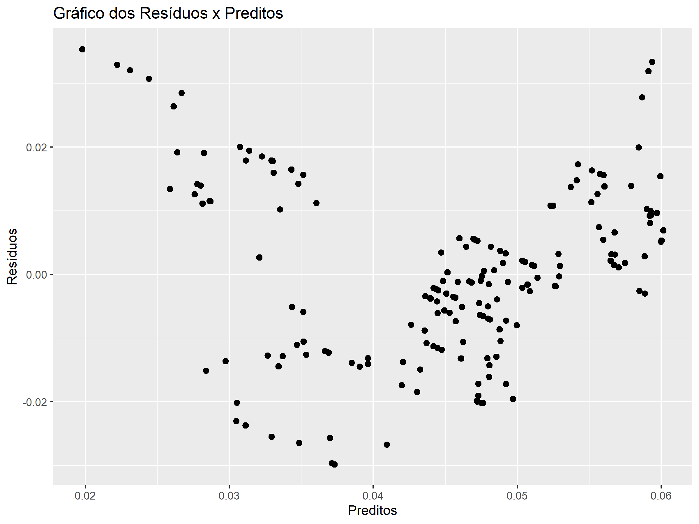
  <br>
  <em>Figura 5: Gráfico de Dispersão - Resíduos x Valores Preditos</em>
</p>

Aplicando o Teste de Breusch-Pagan, obteve-se o p-valor de $3.92e^{-09}$ e, portanto, rejeitamos a hipótese nula de homocedasticidade dos erros.

### Regressão Linear Bayesiana - Priori Fracamente Informativa

Considerando as prioris não-informativas:

$$
\beta_0 \sim N((\frac{\sum_{i=1}^n (\beta_1 x_i-y_i)}{(n + \frac{\sigma^2}{\sigma^2_b})}), (\frac{n}{\sigma^2} + \frac{1}{\sigma^2_b})^{-1})
$$

Utilizando Amostrador de Gibbs para amostrar valores dos parâmetros desejados obtemos as cadeias na figura \ref{Figura6}. Descartando os primeiros 1000 valores amostrados e descartando um a cada 5 valores, vemos uma convergência para os coeficientes $\beta_0$ e $\beta_1$, sendo ambas bem próximas a 0. Os parâmetros utilizados nesta priori foram:

1. ($\beta_0^{(0)},\beta_0^{(0)},{\sigma^2}^{(0)}$) = ($0,0,1000$)
2. $\alpha =0,1$
3. $\beta = 0,1$
4. $\sigma^2_b = 1$
5. $\tau = 0,2$
6. Iterações: $10000$.

A taxa de aceitação da cadeia foi de $30,65%$.

<p align="center">
  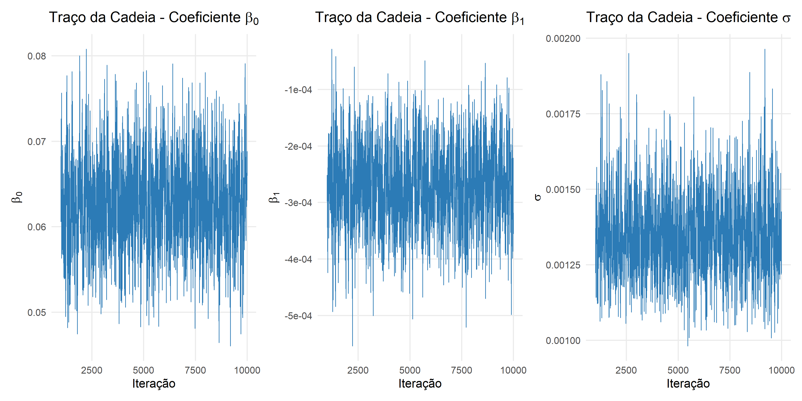
  <br>
  <em>Figura 6: Traço das Cadeias de Markov - Priori Fracamente Informativa</em>
</p>

O gráfico das autocorrelações mostra que a autocorrelação decresce rapidamente e há convergência.

<p align="center">
  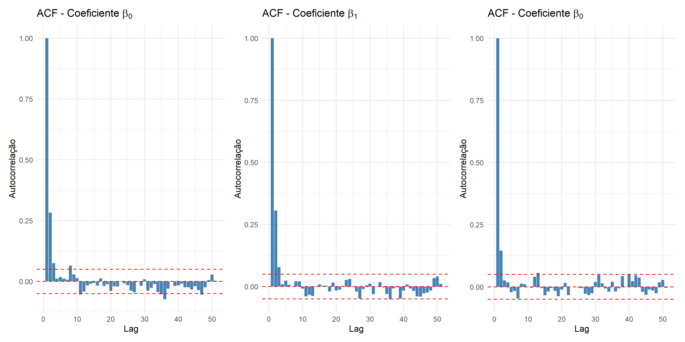
  <br>
  <em>Figura 7: Autocorrelações - Priori Fracamente Informativa</em>
</p>


### Regressão Linear Bayesiana - Priori Informativa

Novamente com as mesmas prioris anteriores e o mesmo método de thinning e burn-in, apenas calibrando parâmetros temos

1. ($\beta_0^{(0)},\beta_0^{(0)},{\sigma^2}^{(0)}$) = ($0,0,2$)
2. $\alpha =0,1$
3. $\beta = 0,1$
4. $\sigma^2_b = 1$
5. $\tau = 0,2$
6. Iterações: $10000$.
\end{enumerate}

<p align="center">
  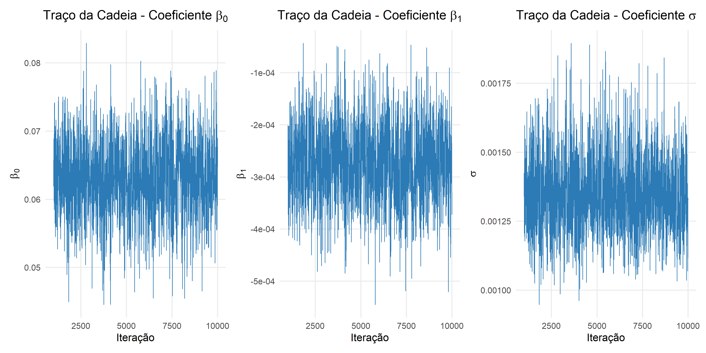
  <br>
  <em>Figura 8: Traço das Cadeias de Markov - Priori Informativa</em>
</p>

Assim como a priori anterior, o gráfico de autocorrelações mostra que a autocorrelação decresce rapidamente e há convergência.

<p align="center">
  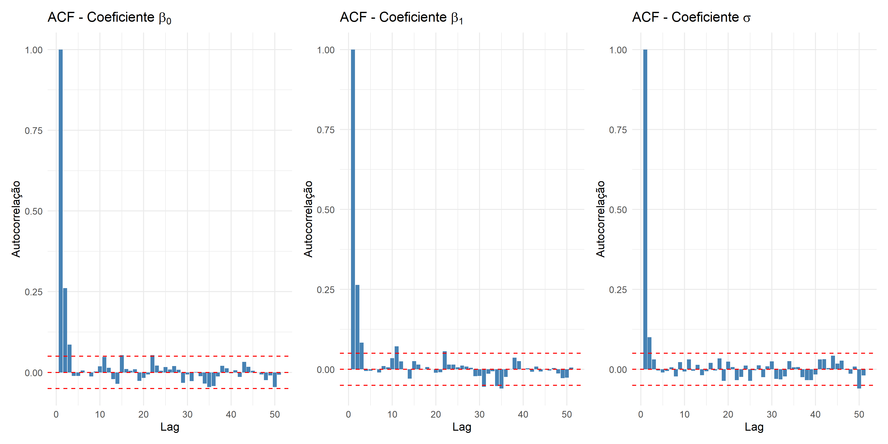
  <br>
  <em>Figura 9: Autocorrelações - Priori Informativa</em>
</p>

## Resultados e Discussão

A densidade dos coeficientes para ambas as prioris se mostram bem semelhantes com apenas a priori informativa sendo menos amplo. O comportamento dos coeficientes da regressão está muito próxima de 0. Para o coeficiente angular é condizente visto que os valores da variável explicativa cresce tendenciosamente ao longo do tempo, estando na casa das centenas, enquanto a variável dependente é uma taxa que varia entre 0 e 1. Todavia, pode ser um indicativo de falta de ajuste, visto que há réplicas no conjunto de dados (a taxa de juros se mantém constante por meses).

<p align="center">
  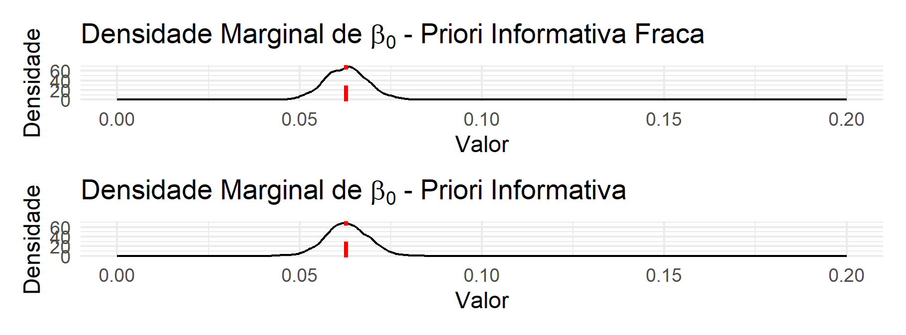
  <br>
  <em>Figura 10: Densidade Marginal - Coeficiente $\beta_0$</em>
</p>

<p align="center">
  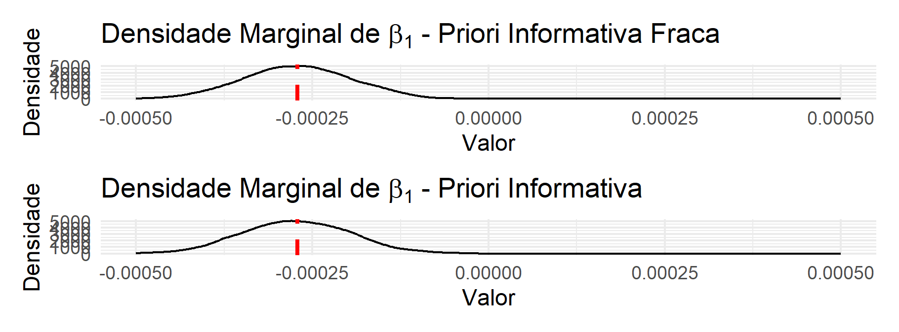
  <br>
  <em>Figura 11: Densidade Marginal - Coeficiente $\beta_1$</em>
</p>
<p align="center">
  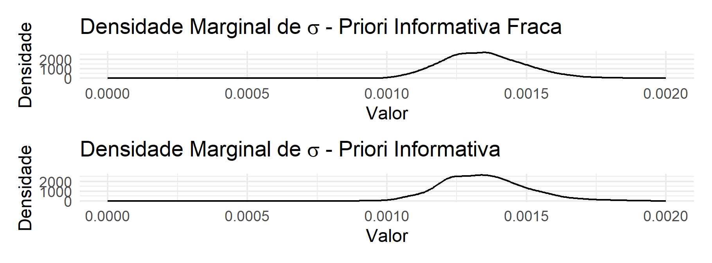
  <br>
  <em>Figura 12: Densidade Marginal - Coeficiente $\sigma^2$</em>
</p>

As métricas $WAIC$ calculadas para os modelos estão dispostas na tabela abaixo. A diferença entre os modelos é ínfima, não havendo uma predileção de qual modelo utilizar. Como a diferença é pouca, faz-se necessário testar outros parâmetros, calibrando, também, parâmetros secundários.

| **Priori** | **WAIC** |
|------------|----------|
| **Não Informativa** | -817.8869 |
| **Informativa** | -817.8362 |

Ao comparar medidas-resumo referentes aos parâmetros amostrados pelas prioris não-informativa e informativa conjuntamente aos parâmetros da regressão linear temos a tabela:

| **Priori** | **Parâmetro** | **Média** | **Mediana** | **Moda** | **IC 95% Inf** | **IC 95% Sup** | **WAIC do Modelo** |
|------------|---------------|-----------|-------------|----------|---------------|---------------|-------------------|
| **Informativa** | $\beta_0$ | 0.062923 | 0.062792 | 0.062486 | 0.051626 | 0.07406 | -817.8362 |
| **Informativa** | $\beta_1$ | -0.000273 | 0.000273 | -0.000419 | -0.00012 | 0.000157 | -817.8362 |
| **Informativa** | $\sigma^2$ | 0.0013473 | 0.001334 | 0.001338 | 0.001084 | 0.001672 | -817.8362 |
| **Não Informativa** | $\beta_0$ | 0.062770 | 0.062791 | 0.063445 | 0.051442 | 0.074432 | -817.8869 |
| **Não Informativa** | $\beta_1$ | -0.000271 | -0.000272 | -0.000264 | -0.000419 | -0.000124 | -817.8869 |
| **Não Informativa** | $\sigma^2$ | 0.001347 | 0.001337 | 0.001349 | 0.001093 | 0.001663 | -817.8869 |
| **Modelo Original** | $\beta_0$ | 0.062791 |  |  | 0.060622 | 0.06496 |  |
| **Modelo Original** | $\beta_1$ | -0.000271 |  |  | -0.0003 | -0.000243 |  |
| **Modelo Original** | $\sigma^2$ | 0.00019 |  |  | 0.0001558 | 0.000237 | - |


As estimativas para os coeficientes são semelhantes considerando tanto a regressão bayesiana quanto a original. A diferença notável é o estreitamento do intervalo de confiança de 95\% para os coeficientes quando a priori é inclusa no modelo, seja ela informativa ou não e a flexibilidade do coeficiente $\sigma^2$ considerando a abordagem bayesiana, como queríamos.

## Conclusão

As distribuições a posteriori das regressões com prioris informativa e não-informativa não tiveram performances muitos diferentes, muito provavelmente pela necessidade de se testar diversos valores para cada parâmetro (incluindo os parâmetros secundários), o que geraria uma diferença teórica. 
Assim, os resultados das análises realizadas com a priori não informativa e a priori informativa não revelaram diferença significativa entre os modelos adotados. As métricas calculadas, incluindo a média, mediana, moda e intervalo de confiança de $\theta$, apresentaram valores muito semelhantes, indicando que a escolha entre essas duas prioris não teve impacto significativo nos resultados obtidos. Esses resultados indicam que, neste caso, a escolha entre uma priori não informativa e uma priori informativa não afetou de forma significativa as estimativas dos parâmetros estudados.
Além disso, as cadeias alcançaram convergência e suas autocorrelações decresceram rapidamente conforme o número de defasagens.
O objetivo inicial era flexibilizar a variância dados que as séries utilizadas são heterocedásticas, o que foi alcançado pois o intervalo de confiança considerando a abordagem bayesiana leva a uma gama maior de valores para $\sigma^2$, como visto na tabela 4.2.

<p align="center"></p>
<p align="center"></p>
